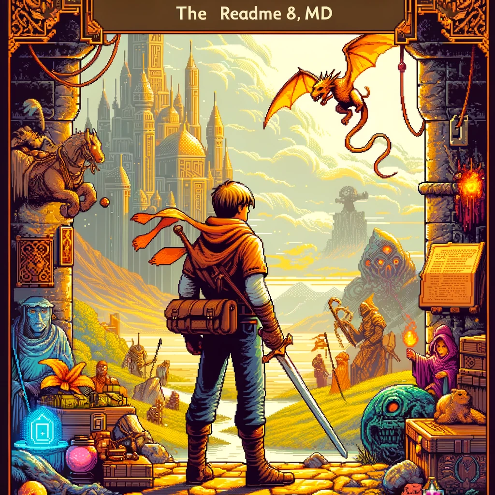

# Gildas-Invade RPG

Gildas-Invade RPG
Welcome to "Gildas-Invade," an immersive RPG where players embody the intrepid hero, Gildas. Set in a realm far from peace, Gildas embarks on a perilous quest to uncover and reclaim a long-lost treasure of immense value. Navigate through various challenging levels, each brimming with formidable foes, cunning traps, and puzzles that test your wit and valor.

Developed by a trio of in a 6 day sprint, "Gildas-Invade" waa our testament to the classic RPG genre, reviving traditional battle mechanics, intricate menus, and engaging player interactions. Crafted entirely in C more precisely CSFML, this project was not just game development, but also a challenge to harness the capabilities of a fundamental programming language to bring an intricate and interactive world to life.

Join Gildas in his quest, fight through adversity and emerge victorious, Join Gildas in his unique adventures.

## Usage

Clone the following repository:

And then just `make` this will compile the different tools, files, and libraries the game need to use. And then launch the game using the `./my_rpg`